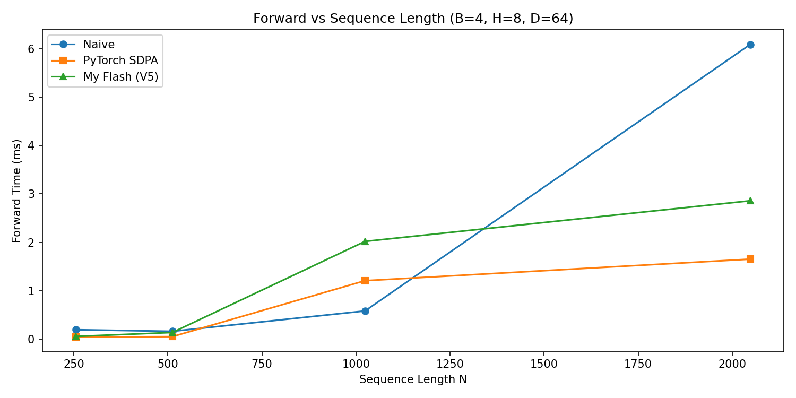
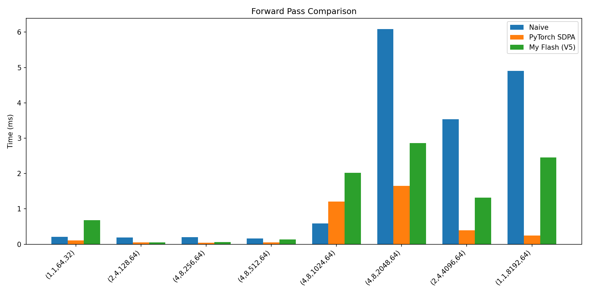
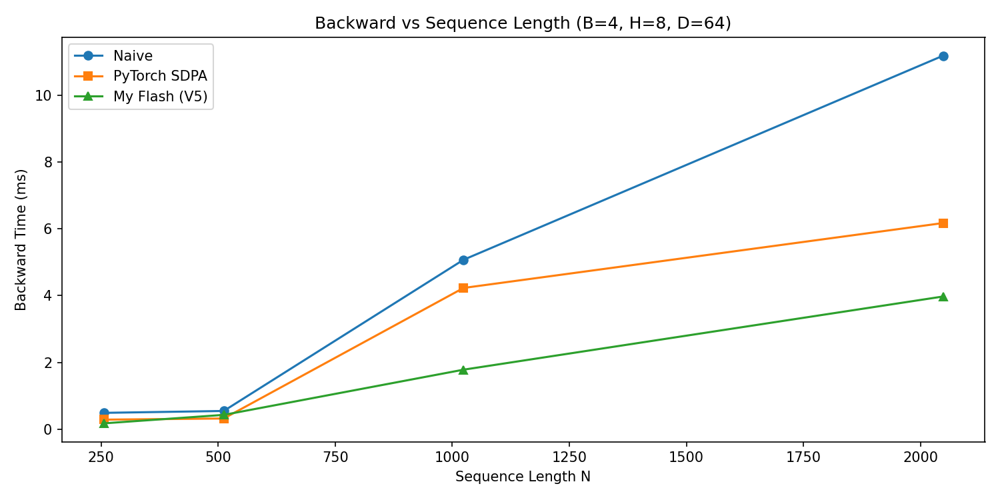
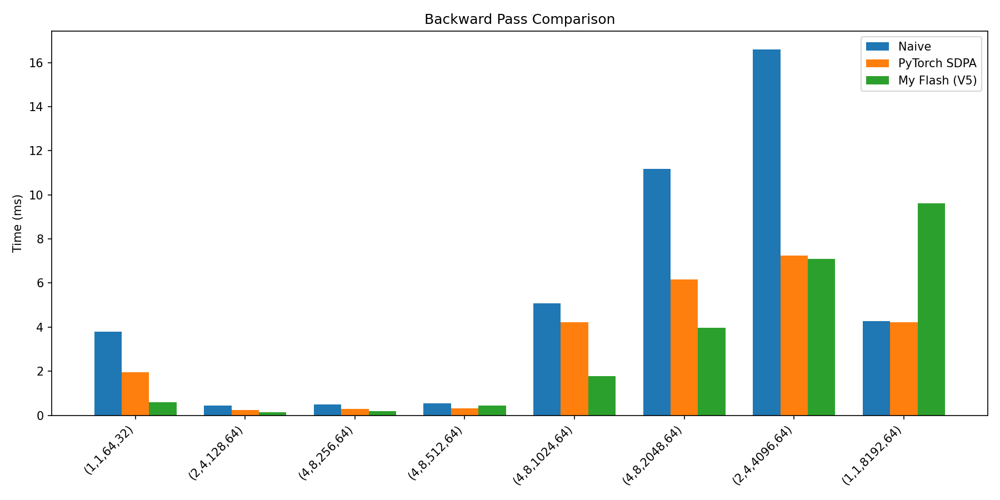

# Simple Flash Attention

A from-scratch CUDA implementation of **Flash Attention 2** with **forward + backward** kernels, optimized by **fp16 + Tensor Cores (V5)**.  
This project is distilled from the educational tutorial [Flash Attention 2 in CUDA — From Scratch](https://github.com/WillCastells/flash-attention-2-cuda), focusing on the final high‑performance V5 variant.

## Algorithm Overview

Flash Attention avoids materialising the O(N²) attention matrix by fusing **online softmax** with **tiled matmul**.  
The backward pass recomputes attention weights from stored log‑sum‑exp values, so no intermediate N×N matrices need to be saved.

| Version | Description                     | Precision       | Key Techniques                                  |
|---------|---------------------------------|-----------------|-------------------------------------------------|
| V1      | Naive 3‑pass attention          | fp32            | Baseline, full N×N matrix                       |
| V2      | Flash Attention 2 forward       | fp32            | Online softmax, tiling, shared memory           |
| V3      | Flash Attention 2 backward      | fp32            | Recompute P, atomicAdd accumulation             |
| V4      | Optimised forward + backward    | fp32            | Collaborative matmul, split backward, float4    |
| **V5**  | **Tensor Core forward + backward** | fp16 in / fp32 accum | WMMA 16×16×16, atomics‑free split backward |

The current `flash_attn.cu` corresponds to **V5** and requires an NVIDIA GPU with SM 7.0+ (Tensor Cores).

## Quick Start

**Requirements**: Python 3.10+, PyTorch 2.x with CUDA, NVIDIA GPU (e.g., RTX 20 series or newer).

No CMake needed – uses PyTorch JIT compilation:

```bash
# Run correctness tests (forward + backward)
python test.py

# Run full performance benchmarks (generates plots in fig/)
python bench.py
```

## Testing & Accuracy

`test.py` verifies causal self‑attention against a manual PyTorch reference (fixed random seed).  
- **Forward**: output O and log‑sum‑exp L match reference values  
- **Backward**: gradients dQ, dK, dV match `torch.autograd` results  

All tests pass with `atol=1e-2, rtol=1e-3`, consistent with fp16 numerical expectations.

## Performance Snapshot

Hardware: **NVIDIA GeForce RTX 4090 (24 GB)**, CUDA 12.2

### Forward Pass (ms)

| Config (B, H, N, D)  |  Naive   | PyTorch SDPA | My Flash (V5) |
|----------------------|----------|--------------|---------------|
| 1, 1, 64, 32         | 0.20     | **0.11**     | 0.68          |
| 2, 4, 128, 64        | 0.19     | **0.05**     | **0.05**      |
| 4, 8, 256, 64        | 0.20     | **0.05**     | 0.06          |
| 4, 8, 512, 64        | 0.16     | **0.05**     | 0.14          |
| 4, 8, 1024, 64       | **0.58** | 1.21         | 2.02          |
| 4, 8, 2048, 64       | 6.09     | **1.65**     | 2.86          |
| 2, 4, 4096, 64       | 3.53     | **0.39**     | 1.32          |
| 1, 1, 8192, 64       | 4.90     | **0.25**     | 2.45          |

**Forward:** Our V5 lags behind on short sequences due to launch overhead, but catches up to within 1.7× of SDPA at N=2048, proving Tensor Core tiling scales better with longer contexts.

### Backward Pass (ms)

| Config (B, H, N, D) | Naive | PyTorch SDPA | My Flash (V5) |
|----------------------|-------|--------------|---------------|
| 1, 1, 64, 32         | 3.81  | 1.96         | **0.60**      |
| 2, 4, 128, 64        | 0.44  | 0.25         | **0.14**      |
| 4, 8, 256, 64        | 0.49  | 0.29         | **0.18**      |
| 4, 8, 512, 64        | 0.55  | **0.33**     | 0.43          |
| 4, 8, 1024, 64       | 5.07  | 4.23         | **1.79**      |
| 4, 8, 2048, 64       | 11.18 | 6.17         | **3.97**      |
| 2, 4, 4096, 64       | 16.60 | 7.25         | **7.11**      |
| 1, 1, 8192, 64       | 4.27  | **4.22**     | 9.63          |

**Backward:** Similar overhead at small N, yet our kernel beats SDPA at N=1024–2048 and stays competitive at larger sizes, thanks to atomics‑free split design and Tensor Core recomputation.

## Visualization

<div style="display: flex; flex-wrap: wrap; gap: 10px; justify-content: center;">
  
  
  
  
</div>

## References

- [FlashAttention: Fast and Memory-Efficient Exact Attention with IO-Awareness](https://arxiv.org/abs/2205.14135) (Dao et al., 2022)
- [FlashAttention-2: Faster Attention with Better Parallelism and Work Partitioning](https://arxiv.org/abs/2307.08691) (Dao, 2023)
- Original tutorial implementation: [Flash Attention 2 in CUDA — From Scratch](https://github.com/WillCastells/flash-attention-2-cuda)
